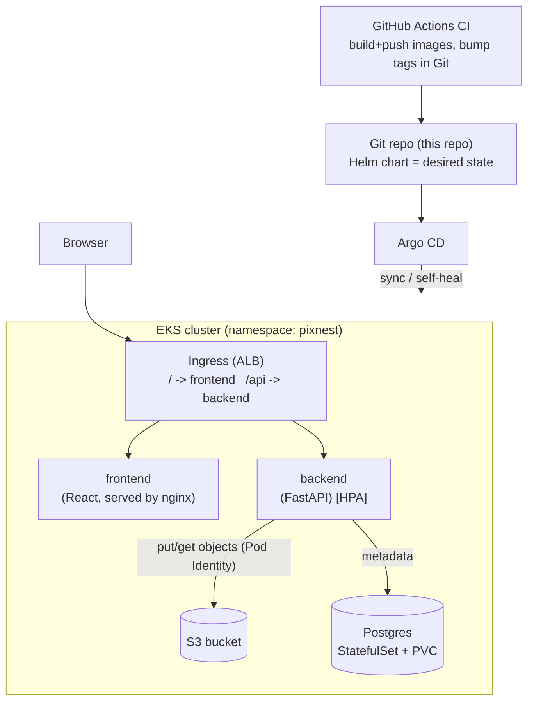
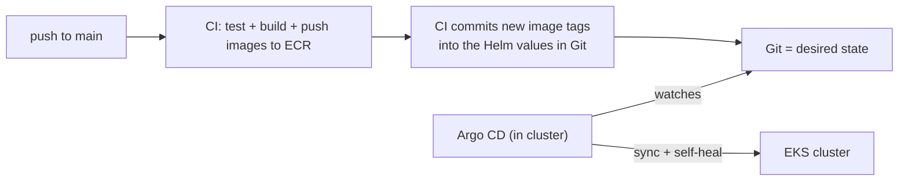

# pixnest - Architecture and Build Plan

> A full-stack **photo gallery** on Amazon EKS, delivered by **GitOps (ArgoCD)** - built to be enhanced later with an async worker, AI (semantic search), event-driven autoscaling, supply-chain security, and full observability. A modern cloud-native platform, end to end.

The build is **phased**: **Phase 1** is a complete, working, GitOps-delivered app kept deliberately simple (**no async worker, no queue**). Phases 2+ are additive enhancements that plug into the same architecture with no rework.

---

## Tech stack (final - chosen for modern, in-demand skills)

| Layer | Tech | Phase |
|-------|------|-------|
| **Frontend** | React 18 + **TypeScript** + **Vite** + **Tailwind CSS** + **shadcn/ui** + **TanStack Query** - static, served by **nginx** | 1 |
| **Backend** | Python 3.12 + **FastAPI** + Pydantic v2 + **async SQLAlchemy 2** + asyncpg; deps via **uv** | 1 |
| **Database** | **PostgreSQL 16** in-cluster as a **StatefulSet + PVC** (+ **pgvector** later) | 1 |
| **Object storage** | **Amazon S3** (accessed via **EKS Pod Identity**) | 1 |
| **Containers / Registry** | Docker multi-stage non-root / **Amazon ECR** | 1 |
| **Infra as Code** | **Terraform** (+ terraform-aws-modules), remote state in S3 | 1 |
| **Orchestration** | **Kubernetes (EKS)** + **Helm** | 1 |
| **CI** | **GitHub Actions** | 1 |
| **CD / GitOps** | **Argo CD** (pull-based) | 1 |
| **Async worker + queue** | Python worker + **Amazon SQS** (thumbnails) | 2 |
| **Autoscaling** | **HPA** (1) + **KEDA** event-driven + **Karpenter** nodes | 1 / later |
| **AI** | **pgvector** + **AWS Bedrock** (embeddings + captioning) | 3 |
| **Supply chain** | **cosign** + **Syft** (SBOM) + **Kyverno** | later |
| **Observability** | **OpenTelemetry** + Prometheus + Grafana + SLOs | later |
| **Progressive delivery** | **Argo Rollouts** (canary) | later |

Every choice is a current, high-demand skill in 2026 - the stack itself is part of the resume.

---

## What pixnest does (Phase 1)

Users upload photos in a web UI. Each photo is stored in **S3**; its metadata (filename, size, S3 key, who/when) goes in **Postgres**. The gallery lists photos from the database and displays them directly from S3 via short-lived **presigned URLs**.

The rule it follows: **files go in object storage (S3); facts about the files go in a database (Postgres).** (Thumbnails and async processing come in Phase 2 with the worker.)

---

## Architecture (Phase 1)



**Services we deploy:** `frontend`, `backend`, and `postgres` (a StatefulSet), all in the Helm chart. **Managed dependency:** `S3` (via Pod Identity). **Delivery:** Argo CD watches Git. (An async **worker** + SQS + thumbnails arrives in Phase 2.)

---

## Components (Phase 1)

### frontend (React + TypeScript + Vite + Tailwind + shadcn/ui)
- A single-page app: an **upload form** + a **gallery grid**, using **TanStack Query** to talk to the API.
- Built to static files, served by a small **nginx** container. Ingress routes `/` here.

### backend (FastAPI)
- REST API. Endpoints:
  - `POST /api/photos` - upload: stream the file to **S3**, insert a **Postgres** row, return the created photo.
  - `GET /api/photos` - list photos (from Postgres), each with a short-lived **presigned S3 URL** to display.
  - `GET /api/photos/{id}` - one photo's metadata + presigned URL.
  - `DELETE /api/photos/{id}` - remove the DB row and the S3 object.
  - `GET /health`, `/ready` (checks the DB), `/version`, Swagger at `/docs`.
- Talks to S3 via **EKS Pod Identity** (an association binds its ServiceAccount to an IAM role - no keys, no annotation). Reads DB creds from a **Secret**.
- Has an **HPA** (scales on CPU).

### Postgres (in-cluster StatefulSet)
- Stores metadata. Runs in the cluster as a **StatefulSet** with a **PersistentVolumeClaim** (stable identity + persistent storage), shipped in the Helm chart so it is identical in local and EKS. On EKS this needs the **EBS CSI driver** and a default StorageClass; the volume pins the pod to one AZ.
- Trade-off: running a database in Kubernetes means you own backups, HA, and upgrades. Production-grade options are a database **operator** (CloudNativePG) or a managed service (**RDS/Aurora**).

### S3
- One bucket for the uploaded images. Provisioned by Terraform. Accessed only via the backend's Pod Identity role.

---

## Database schema (the `photos` table)

```sql
CREATE TABLE photos (
    id            UUID PRIMARY KEY,
    filename      TEXT NOT NULL,
    content_type  TEXT NOT NULL,
    size_bytes    BIGINT NOT NULL,
    s3_key        TEXT NOT NULL,
    uploaded_by   TEXT,
    uploaded_at   TIMESTAMPTZ NOT NULL DEFAULT now()
    -- Phase 2 (worker): thumb_key TEXT, status TEXT
    -- Phase 3 (AI):     tags TEXT[], caption TEXT, embedding vector(512)  [pgvector]
);
```

---

## The core flow (Phase 1)

**Upload**
```
UI -> POST /api/photos -> backend:
   1. stream the file to S3 (key: <id>/<filename>)
   2. INSERT a photos row
   3. return 201 + the new photo (with a presigned URL)
```

**Gallery**
```
UI -> GET /api/photos -> backend lists rows from Postgres,
     attaches a short-lived presigned S3 URL to each -> UI renders  tags.
```

No async work, no queue - uploads are a single request. (Phase 2 moves thumbnail generation off this path into a worker.)

---

## Delivery: GitOps with Argo CD

Unlike a push-based pipeline, pixnest uses **pull-based GitOps**:



- **CI's job ends in Git:** it builds/pushes the images and updates the image tags in the chart's values (a commit). It never touches the cluster.
- **Argo CD** watches this repo, notices the change, and **syncs** the cluster - and **auto-heals** any drift.
- An **`Application`** manifest (in `deploy/argocd/`) tells Argo CD which repo/path/chart to watch and which cluster/namespace to deploy to.

Benefits to call out: Git is the single source of truth and audit log; rollback is `git revert`; the cluster credentials never live in CI.

---

## Infrastructure (Terraform, Phase 1)

`terraform/` provisions (reusing the proven OIDC pattern from the earlier project):

| Resource | Purpose |
|----------|---------|
| **ECR repos** (frontend, backend) | Where CI pushes images |
| **S3 bucket** | Photo storage |
| **Backend role + Pod Identity** | Read/write the S3 bucket - least privilege |
| **GitHub OIDC role** | CI pushes to ECR and commits to Git (keyless) |
| **EKS access / namespace** | Where it runs |
| **Argo CD** (Helm release or manifest) | The GitOps controller |

Postgres is not in Terraform; it is a **StatefulSet** in the Helm chart. (Phase 2 adds an **SQS** queue and a **worker** Pod Identity role.)

---

## Helm layout (Phase 1)

One chart PER COMPONENT (as separate teams would own them), composed by the Argo CD
app-of-apps with sync waves (postgres -> backend -> frontend):
```
infra/helm/
├── postgres/     # hardened StatefulSet + PVC + Secret + NetworkPolicy
├── backend/      # Deployment + Service + HPA + SA (Pod Identity) + config/secret + NP + PDB
└── frontend/     # Deployment + Service + the app Ingress + NP + PDB
```
Each chart has `values.yaml` (base; CI bumps the image tags) plus `values-local.yaml`
(minikube) and `values-eks.yaml` overlays. Cross-chart wiring uses fixed Service names
(`pixnest-backend`, `pixnest-postgres`). (Phase 2 adds a `worker/` chart.)

---

## CI (GitHub Actions)

`.github/workflows/ci.yml` on push/PR to main (path-aware per service):
- **backend:** ruff (lint + format) + pytest (AWS/DB mocked, so CI is green without real cloud)
- **frontend:** npm ci + typecheck + build
- **build:** docker build both images + `helm lint`
On merge to main, a **release** job builds+pushes the two images to ECR and **commits the new tags** into `values.yaml` (the GitOps handoff). Argo CD does the rest.

---

## Phased build roadmap

### Phase 1 - the working app (now)
1. **backend** (FastAPI: upload/list/delete, S3 via Pod Identity, Postgres) + tests
2. **frontend** (React/TS gallery + upload)
3. **Dockerfiles** for both
4. **Terraform**: ECR x2, S3, backend role (Pod Identity), GitHub OIDC role (Postgres is a StatefulSet in the chart)
5. **Helm chart** (frontend + backend) + Ingress
6. **CI** (test/build/push + tag-bump-to-Git)
7. **Argo CD**: install + an `Application` -> live GitOps delivery

### Phase 2 - async worker + thumbnails (the "level up")
- Add **SQS** + a **worker** that generates thumbnails off the request path, and **KEDA** to scale the worker on queue depth (even to zero). Decoupling and event-driven scaling.

### Phase 3 - AI
- Add **pgvector**; on upload, auto-tag + caption via **AWS Bedrock** and store an embedding; backend adds `GET /api/search?q=...` for **semantic search**.

### Phase 4 - supply chain / DevSecOps
- **cosign** sign images + **SBOM** (Syft) + a **Kyverno** policy that only lets signed images run.

### Phase 5 - observability
- **OpenTelemetry** traces + **Prometheus/Grafana** + **SLOs**.

### Phase 6 - progressive delivery
- **Argo Rollouts**: automated **canary** of the backend.

Each phase is additive - Phase 1's architecture already has the seams (backend, DB, S3) that every later phase plugs into.

---

## Concept map

| Piece | Concept it exercises | Phase |
|-------|----------------------|-------|
| Multi-service Helm + Ingress routing | Kubernetes app modeling, service discovery | 1 |
| S3 + EKS Pod Identity | Object storage + **pod-level IAM** (the modern successor to IRSA) | 1 |
| Postgres StatefulSet + PVC + Secret | **Stateful workloads** in Kubernetes (persistence, stable identity) + secrets | 1 |
| Argo CD | **GitOps** (pull-based delivery, drift/self-heal) | 1 |
| CI tag-bump to Git | The CI/CD handoff in a GitOps world | 1 |
| HPA | Autoscaling on CPU | 1 |
| SQS + worker + KEDA | **Async decoupling** + **event-driven autoscaling** | 2 |
| pgvector + Bedrock | **AI integration**, embeddings, vector search | 3 |
| cosign/SBOM/Kyverno | **Supply-chain security**, policy-as-code | 4 |
| OTel + SLOs | **Observability** maturity | 5 |

---

## Tools

`git`, `node`+`npm`, `python`, `uv`, `docker`, `kubectl`, `helm`, `terraform`, `aws` CLI, `argocd` CLI, `gh` CLI. Cloud: AWS + an EKS cluster.

---

## Status

- [x] Repo created (`JAGADEESH-2809/te-5th_and_6th_batch_assignments`)
- [x] Plan + tech stack locked
- [ ] Phase 1 build (this is next)
- [ ] Phases 2-6 (later, additive)

Next step: build **Phase 1** - backend first (S3/Pod Identity + Postgres), then frontend, then Docker/Terraform/Helm/CI, then stand up Argo CD.

